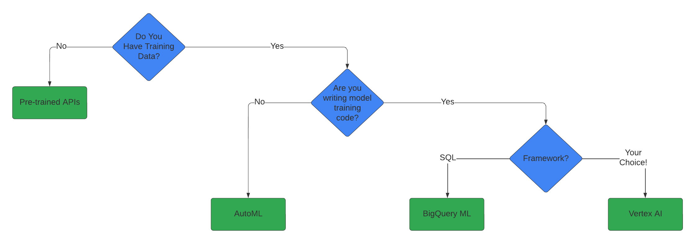
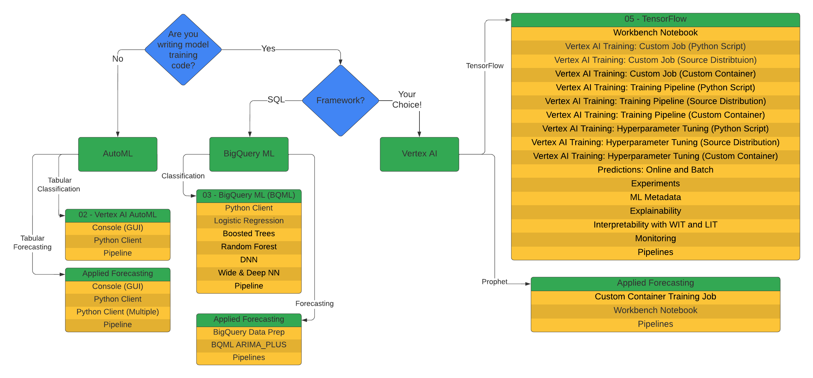
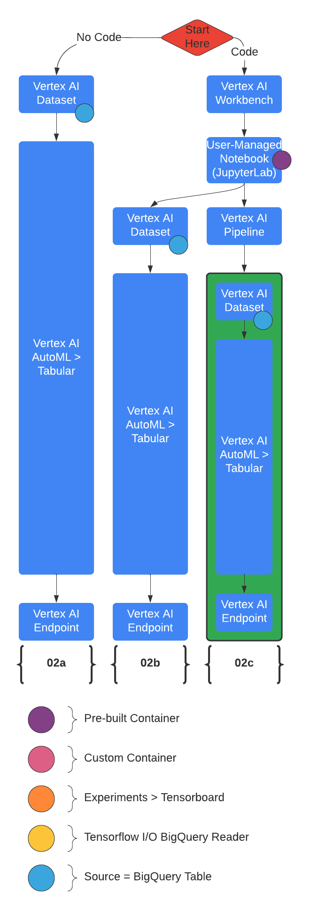
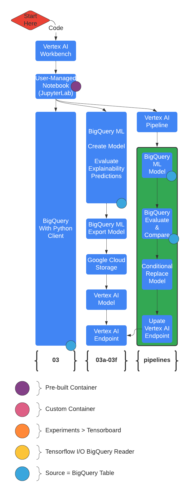
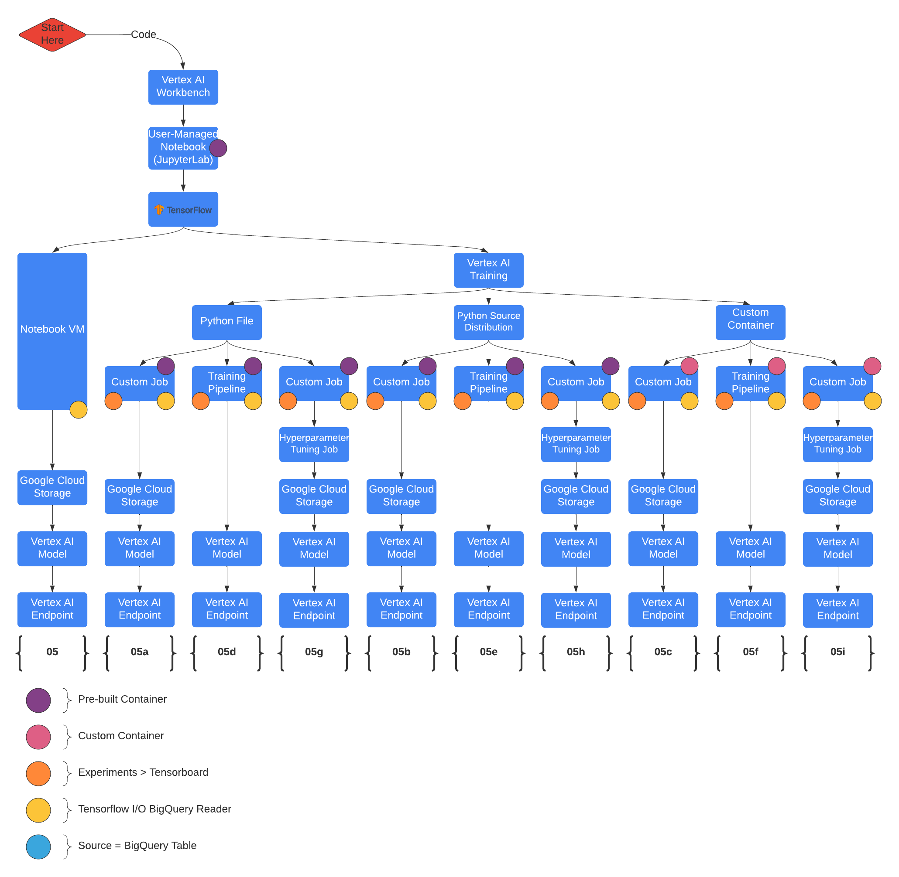
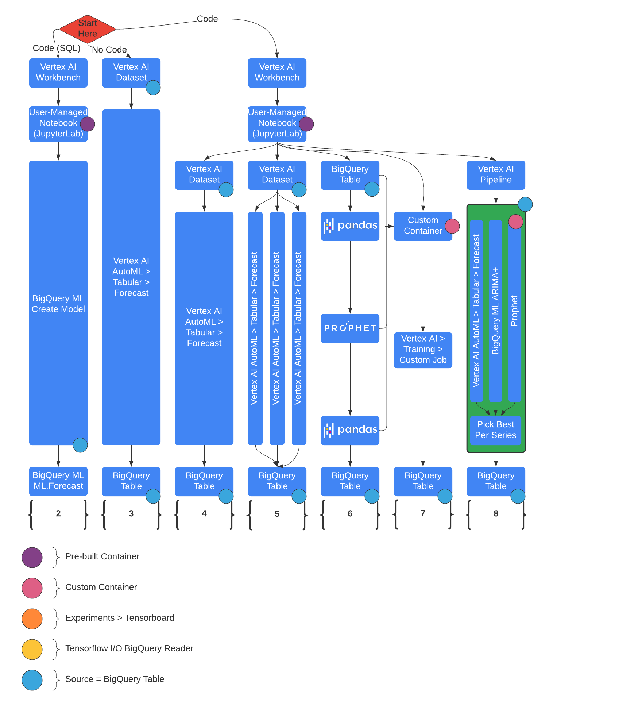

# Vertex AI for Machine Learning Operations

## Overview

This is a series of workflow demonstrations that use the same data source to build and deploy the same machine learning model with different frameworks and automation.  These are meant to help get started in understanding and learning Vertex AI and provide starting points for new projects.  

The demonstrations focus on workflows and don't delve into the specifics of ML frameworks other than how to integrate and automate with Vertex AI. Let me know if you have ideas for more workflows or details to include!

To understand the contents of this repository, the following charts uncover the groupings of the content.

| Direction |
:-------------------------:

### Pre-Trained APIs
<table style='text-align:center;vertical-align:middle' width="100%" cellpadding="1" cellspacing="0">
    <tr>
        <th colspan='4'>Pre-Trained Models</th>
        <th rowspan='2'>
            
            <a href="https://cloud.google.com/vertex-ai/docs/beginner/beginners-guide" target="_blank">AutoML</a>
        </th>
    </tr>
    <tr>
        <th>Data Type</th>
        <th>Pre-Trained Model</th>
        <th>Prediction Types</th>
        <th>Related Solutions</th>
    </tr>
    <tr>
        <td rowspan='2'>
            
             Text
        </td>
        <td>
            
             <a href="https://cloud.google.com/translate/docs/overview" target="_blank">Cloud Translation API</a>
        </td>
        <td>Detect, Translate</td>
        <td>
            
             <a href="https://cloud.google.com/text-to-speech/docs/basics" target="_blank">Cloud Text-to-Speech</a>
        </td>
        <td>
            
             <a href="https://cloud.google.com/translate/automl/docs" target="_blank">AutoML Translation</a>
        </td>
    </tr>
            <tr>
                <td>
                   
                    <a href="https://cloud.google.com/natural-language/docs/quickstarts" target="_blank">Cloud Natural Language API</a>
                </td>
                <td>
                    Entities (Identify and label), Sentiment, Entity Sentiment, Syntax, Content Classification
                </td>
                <td>
                    
                     <a href="https://cloud.google.com/healthcare-api/docs/how-tos/nlp" target="_blank">Healthceare Natural Language API</a>
                </td>
                <td>
                    
                     <a href="https://cloud.google.com/vertex-ai/docs/training-overview#text_data" target="_blank">AutoML Text</a>
            </tr>
    <tr>
        <td>
            
             Image
        </td>
        <td>
            
             <a href="https://cloud.google.com/vision/docs/features-list" target="_blank">Cloud Vision API</a>
        </td>
        <td>
            Crop Hint, OCR, Face Detect, Image Properties, Label Detect, Landmark Detect, Logo Detect, Object Localization, Safe Search, Web Detect
        </td>
        <td>
            <table>
                <tr>
                    <td>
                        
                         <a href="https://cloud.google.com/document-ai/docs/processors-list" target="_blank">Document AI</a>
                    </td>
                    <td>
                        
                         <a href="" taget="_blank">Visual Inspection AI</a>
                    </td>
                </tr>
            </table>
        </td>
        <td>
            
             <a href="https://cloud.google.com/vertex-ai/docs/training-overview#image_data" target="_blank">AutoML Image</a>
        </td>
    </tr>
    <tr>
        <td>
            
             Audio
        </td>
        <td>
            
             <a href="https://cloud.google.com/media-translation" target="_blank">Cloud Media Translation API</a>
        </td>
        <td>Real-time speech translation</td>
        <td>
            
             <a href="https://cloud.google.com/speech-to-text/docs/basics" target="_blank">Cloud Speech-to-Text</a>
        </td>
        <td></td>
    </tr>
    <tr>
        <td>
            
             Video
        </td>
        <td>
            
             <a href="https://cloud.google.com/video-intelligence/docs/quickstarts" target="_blank">Cloud Video Intelligence API</a>
        </td>
        <td>
            Label Detect*, Shot Detect*, Explicit Content Detect*, Speech Transcription, Object Tracking*, Text Detect, Logo Detect, Face Detect, Person Detect, Celebrity Recognition
        </td>
        <td>
            
             <a href="https://cloud.google.com/vision-ai/docs/overview" target="_blank">Vertex AI Vision</a>
        </td>
        <td>
            
             <a href="https://cloud.google.com/vertex-ai/docs/training-overview#video_data" target="_blank">AutoML Video</a>
        </td>
    </tr>
</table>

### AutoML
<table style='text-align:center;vertical-align:middle' width="100%" cellpadding="1" cellspacing="0">
    <tr>
        <th colspan='3'>AutoML</th>
    </tr>
    <tr>
        <th>Data Type</th>
        <th>
            
             <a href="https://cloud.google.com/vertex-ai/docs/beginner/beginners-guide" target="_blank">AutoML</a>
        </th>
        <th>Prediction Types</th>
    </tr>
    <tr>
        <td>
            
             Table
        </td>
        <td>
            
             <a href="https://cloud.google.com/vertex-ai/docs/training-overview#tabular_data" target="_blank">AutoML Tables</a>
        </td>
        <td>
            <dl>
                <dt>Classification</dt>
                    <dd>Binary</dd>
                    <dd>Multi-class</dd>
                <dt>Regression</dt>
                <dt>Forecasting</dt>
            </dl>
        </td>
    </tr>
    <tr>
        <td>
            
             Image
        </td>
        <td>
            
             <a href="https://cloud.google.com/vertex-ai/docs/training-overview#image_data" target="_blank">AutoML Image</a>
        </td>
        <td>
            <dl>
                <dt>Classification</dt>
                    <dd>Single-label</dd>
                    <dd>Multi-label</dd>
                <dt>Object Detection</dt>
            </dl>
        </td>
    </tr>
    <tr>
        <td>
            
             Video
        </td>
        <td>
            
             <a href="https://cloud.google.com/vertex-ai/docs/training-overview#video_data" target="_blank">AutoML Video</a>
        </td>
        <td>
            <dl>
                <dt>Classification</dt>
                <dt>Object Detection</dt>
                <dt>Action Recognition</dt>
            </dl>
        </td>
    </tr>
    <tr>
        <td>
            
             Text
        </td>
        <td>
            
             <a href="https://cloud.google.com/vertex-ai/docs/training-overview#text_data" target="_blank">AutoML Text</a>
        </td>
        <td>
            <dl>
                <dt>Classification</dt>
                    <dd>Single-label</dd>
                    <dd>Multi-label</dd>
                <dt>Entity Extraction</dt>
                <dt>Sentiment Analysis</dt>
            </dl>
        </td>
    </tr>
    <tr>
        <td>
            
             Text
        </td>
        <td>
            
             <a href="https://cloud.google.com/translate/automl/docs" target="_blank">AutoML Translation</a>
        </td>
        <td>
            Translation
        </td>
    </tr>
</table>

### With Training Data

This work focuses on cases where you have training data:

| Overview |
:-------------------------:

|AutoML|BigQuery ML|Vertex AI| Forecasting with AutoML, BigQuery ML, OSS Prophet |
:---:|:---:|:---:|:---:
|||

## Setup

The demonstrations are presented in a series of JupyterLab notebooks. These can be reviewed directly in [this repository on GitHub](https://github.com/statmike/vertex-ai-mlops) or cloned to your Jupyter instance on [Vertex AI Workbench](https://cloud.google.com/vertex-ai/docs/workbench/notebook-solution).

### Option 1: Review files directly

Select the files and review them directly in the browser or IDE of your choice.  This can be helpful for general understanding and selecting sections to copy/paste to your project.

### Option 2: Run These Notebooks in a Vertex AI Workbench based Notebook 

TL;DR
> In Google Cloud Console, Select/Create a Project then go to Vertex AI > Workbench > User-Managed Notebooks
> - Create a new notebook and Open JupyterLab
> - Clone this repository using Git Menu, Open and run `00 - Environment Setup.ipynb`

1. Create a Project
   1. [Link](https://console.cloud.google.com/cloud-resource-manager), Alternatively, go to: Console > IAM & Admin > Manage Resources
   1. Click "+ Create Project"
   1. Provide: name, billing account, organization, location
   1. Click "Create"
1. Enable the APIs: Vertex AI API and Notebooks API
   1. [Link](https://console.cloud.google.com/flows/enableapi?apiid=aiplatform.googleapis.com,notebooks.googleapis.com)
      1. Alternatively, go to: 
         1. Console > Vertex AI, then enable API
         1. Then Console > Vertex AI > Workbench, then enable API
1. Create A Notebook
   1. [Link](https://console.cloud.google.com/vertex-ai/workbench), Alternatively, go to: Console > Vertex AI > Workbench
   1. Click User-Managed Notebooks
   1. Click "+ Create Notebook" or "+ New Notebook"
   1. Selections:
      1. Tensorflow Enterprise > Tensorflow Enterprise 2.3 > Without GPUs
      1. Provide: name, region = us-central1, machine type = n1-standard-4
      1. some options may be under "Advanced Options"
   1. Click "Create"
1. Open JupyterLab Notebook Instance
   1. Once the Notebook Instance is started click the "Open JupyterLab" link
   1. Clone This Repository to the Notebook Instance
      1. Use the Git Menu at the top or on the left navigation bar to select "Clone a Repository"
      1. Provide the Clone URI of this repository: [https://github.com/khadijakhaldi/VertexAI.git](https://github.com/khadijakhaldi/VertexAI.git)
      1. In the File Browser you will now have the folder "vertex-ai-mlops" that contains the files from this repository
1. Setup the Notebook Environment for these workflows
   1. Open the notebook vertex-ai-mlops/00 - Environment Setup
   1. Follow the instructions and run the cells

Resources on these items:
- [Google Cloud Projects](https://cloud.google.com/resource-manager/docs/creating-managing-projects)
- [Vertex AI environment](https://cloud.google.com/vertex-ai/docs/start/cloud-environment)
- [Introduction to Notebooks](https://cloud.google.com/notebooks/docs/introduction)
- [Create a Notebooks Instance](https://cloud.google.com/notebooks/docs/create-new)
- [Open Notebooks](https://cloud.google.com/notebooks/docs/create-new#open_the_notebook_2)

---
